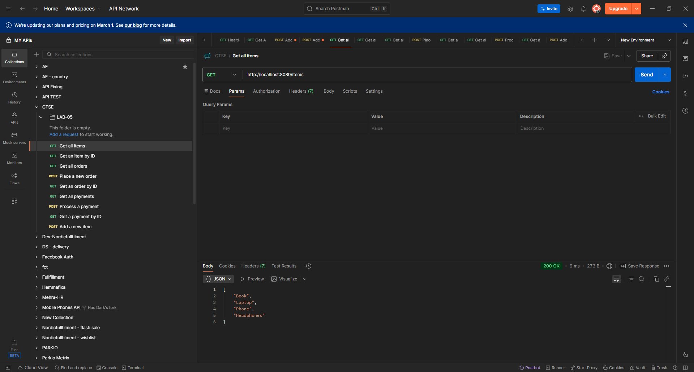
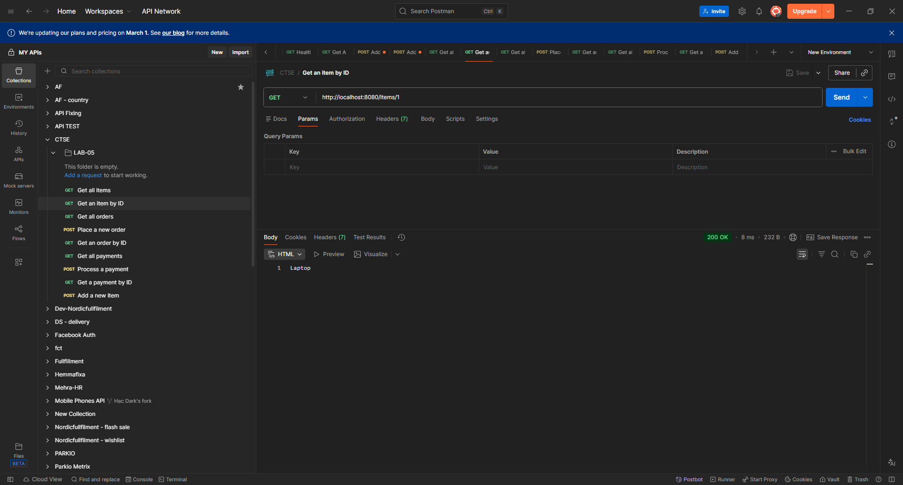
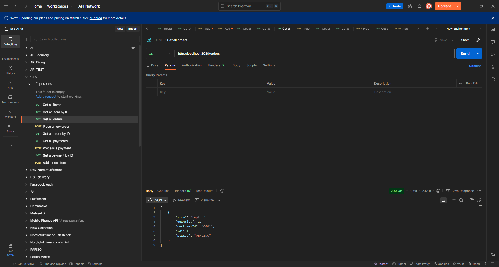
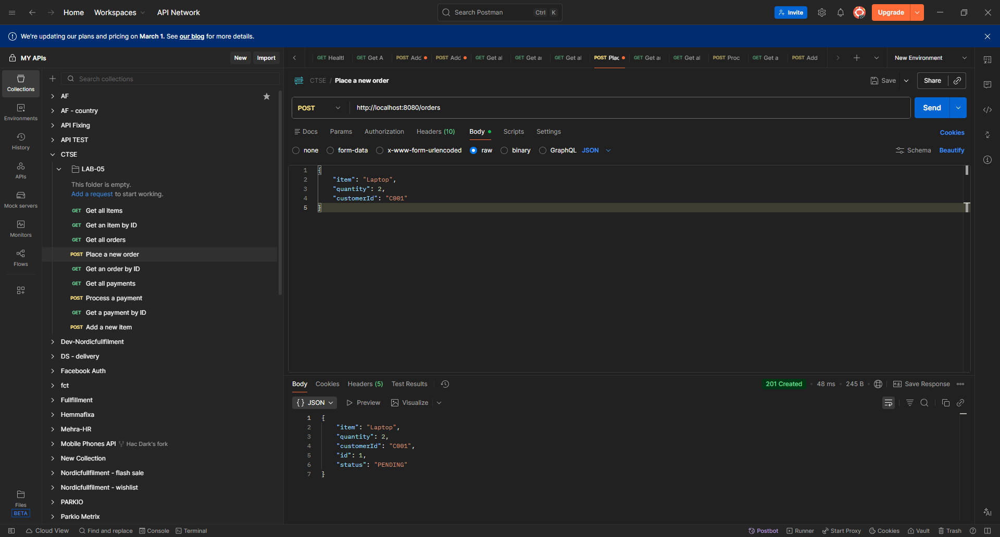
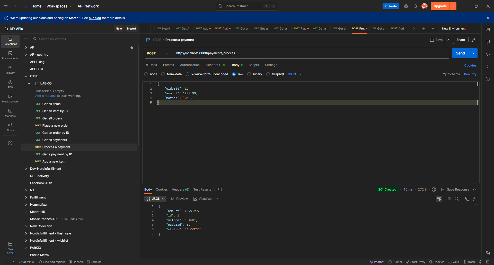
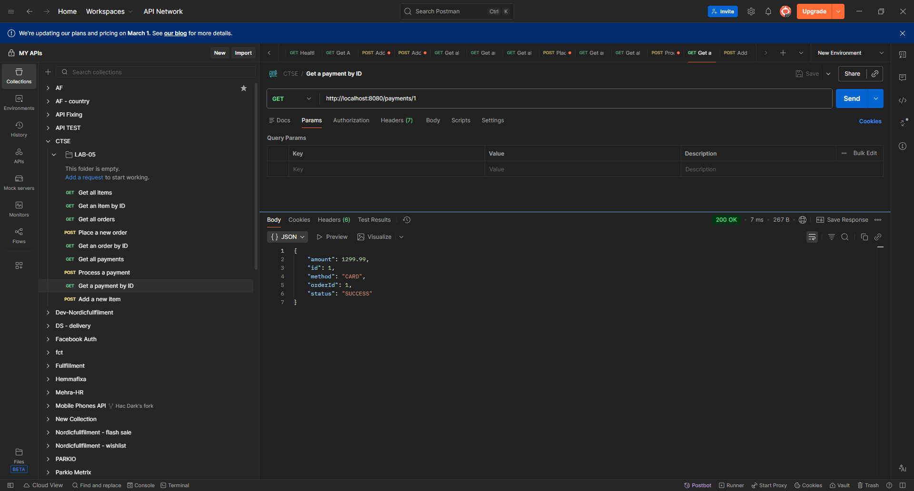
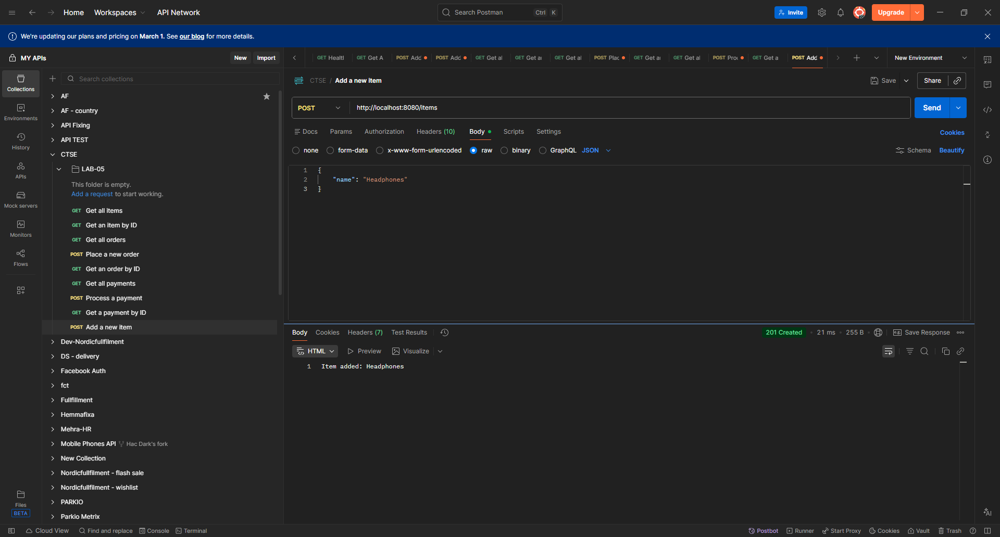

# Microservices Lab Submission

**Name:** Jayalath J.K.A.D.S.P.
**IT Number:** IT22588128

## Services Overview
This project contains four microservices configured to run together using Docker Compose:
- **API Gateway** (Spring Cloud Gateway) - Port 8080
- **Item Service** (Node.js/Express) - Port 8081
- **Order Service** (Spring Boot) - Port 8082
- **Payment Service** (Flask) - Port 8083

## How to Run
1. Ensure Docker Desktop is installed and running.
2. Open a terminal in the root directory and run the following commands:
   ```bash
   # Build the docker images
   docker compose build

   # Start all containers in the background
   docker compose up -d
   ```
3. To stop the services:
   ```bash
   docker compose down
   ```

## API Endpoints Testing Evidence








